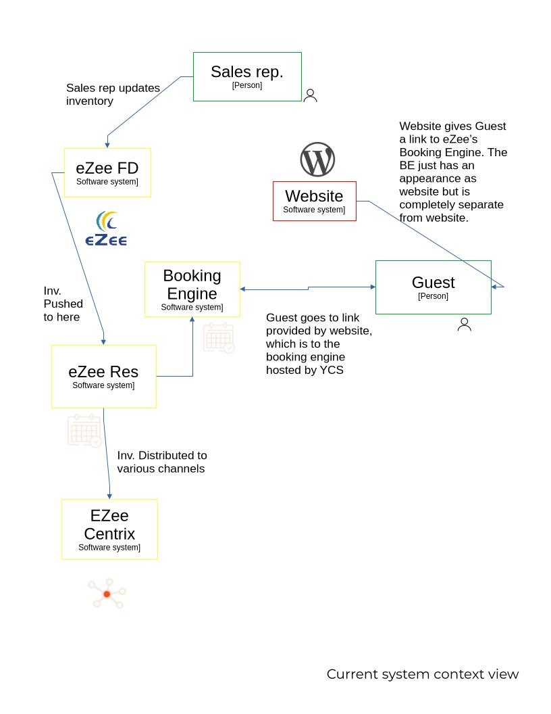
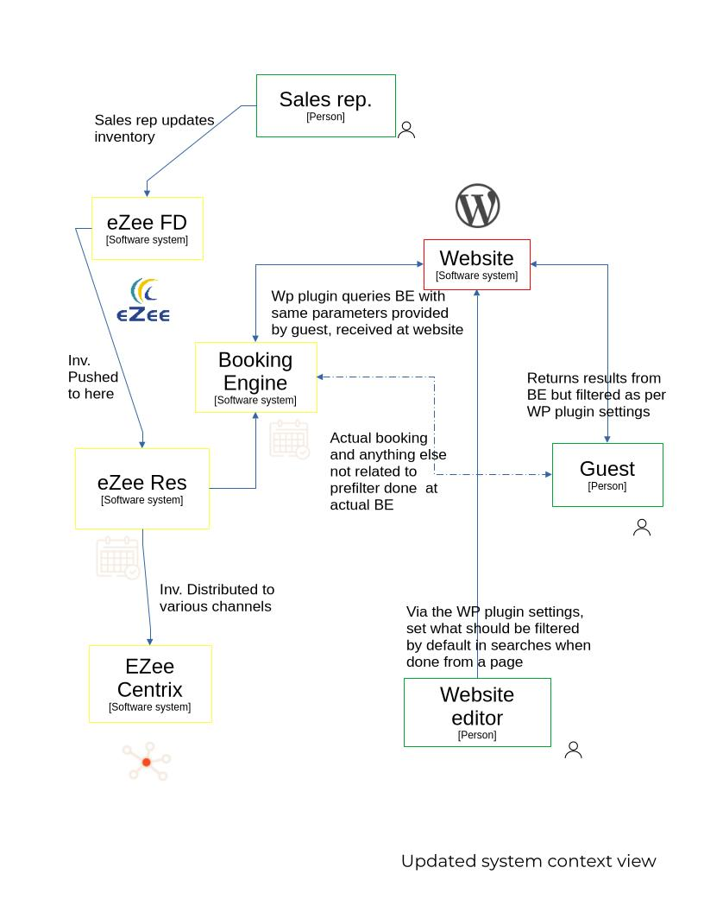
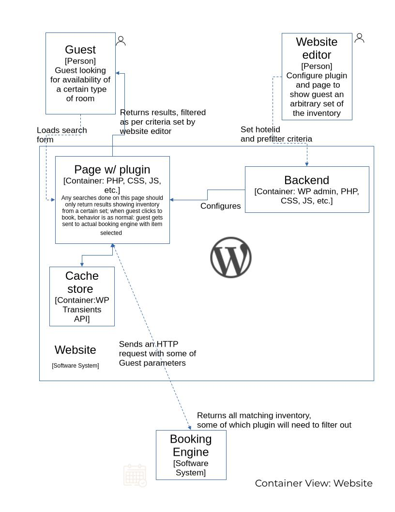

## pbrberpf

### Overview

eZee Technosys (now under Yanolja Cloud Solution) provides an online booking engine for rooms availability search. However, in its customizability, it lacks "pre-filtered" searches.

This plugin is an attempt to provide pre-filtered searches for those scenarios where search results need to exclude some arbitray set of inventory, dependent on some "conversion path."

As it is based on the current booking engine behavior (as of mid 2026,) and not on any official YCS documentation or API, caution is recommended in using this plugin, and it should be monitored in case of a YCS update.

### Architecture

### License

### Author
NPL Programmer <nplprogrammer@gmail.com>
